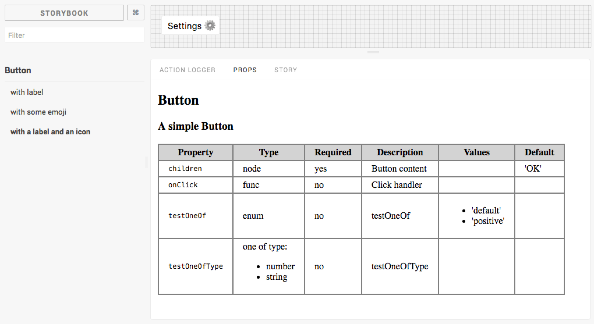
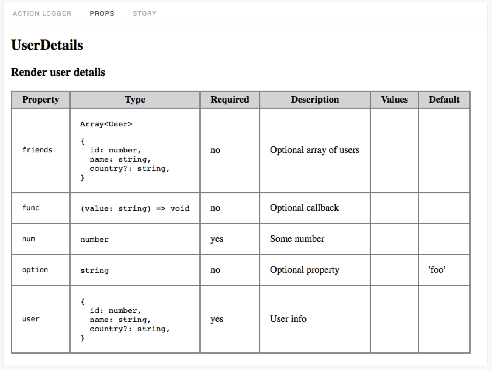

# React Storybook Props addon

This addon provides two new panels for the [Storybook](getstorybook.io) UI.
- **Props**. Shows component properties (extracted by [Storybook](https://voice.kadira.io/component-metadata-react-storybook-ac0b218a2203#.tuzb01kb6) using  [react-docgen](https://github.com/reactjs/react-docgen))



- **Story**. Shows story description and source code.


Visible information are similar to [Storybook Info](https://github.com/storybooks/react-storybook-addon-info) addon, but doesn't alter the output of the story into the preview area. This provides a better usage for the Storyshots feature because snapshot will only contains the rendered story.

### Install

`npm i storybook-addon-props --save-dev`

or (using Yarn) :

`yarn add storybook-addon-props --dev`

### Usage

#### Register addon into the *.storybook/addons.js* file ([view doc](https://getstorybook.io/docs/react-storybook/addons/using-addons))

```js
import '@storybook/addons';
import 'storybook-addon-props/register';
```

#### Set addon into the *.storybook/config.js* file

```js
import { configure, setAddon } from '@storybook/react';
import addWithDoc from 'storybook-addon-props';

setAddon(addWithDoc);

function loadStories() {
  // ...
}
configure(loadStories, module);
```

#### Write stories

Create your stories using the new `addWithDoc` function provided by this addon.

```jsx
import Button from '../Button';

storiesOf('Button', module)
.addWithDoc('with label', Button,
    'It should render a button with a label',
    () => <Button onClick={action('clicked')}>Hello Button</Button>
));
```

For another example, have a look at [this file](example/Button.stories.js).

`addWithDoc` expects the following parameters:

`addWithDoc(storyName, component, description, storyFn)`

| Parameter     | Description                              |
| ------------- | :--------------------------------------- |
| `storyName`   | Name of the story (appears into the Left Panel) |
| `component`   | The main component of the story          |
| `description` | A string displayed into the Story panel  |
| `storyFn`     | The story rendering function             |

#### Options

Alternatively you can configure the `addWithDoc` function using the `configureDoc` named export.

This function allows you to pass an `options` object.

At this time only two options are supported to enable automatic links insertion on a issues tracker when a issue ID pattern is detected into the `description` field of a story.

Supported options are :

| Parameter    | Description                              | Default     |
| ------------ | ---------------------------------------- | ----------- |
| `trackerUrl` | The tracker URL template string. Use `%ID%` to insert the issue ID. |             |
| `pattern`    | The issue ID regexp pattern.             | `#([0-9]+)` |

Pass options into `.storybook/config.js` like this:

``` javascript
import { configureDoc } from 'storybook-addon-props'

const addWithDoc = configureDoc({
  trackerUrl: 'https://github.com/marc-rutkowski/storybook-addon-props/issues/%ID%',
});

setAddon(addWithDoc);
```

Then into a story you can reference an issue like this:

```javascript
storiesOf('Button', module)
.addWithDoc('with label', Button,
  'It should render a button with a label (sample link to tracker #3)',
  () => <Button onClick={action('clicked')}>Hello Button</Button>
)
```

And a link to issue `#3` will be added into the story panel:

 

#### Flow type support

This addon support flow type annotations extracted by [react-docgen](https://github.com/reactjs/react-docgen#flow-type-support).

For the following code :

``` javascript
export type User = {
  id: number,
  name: string,
  country?: string,
};

type Props = {
  /** User info */
  user: User,
  /** Some number */
  num: number,
  /** Optional property */
  option?: string,
  /** Optional callback */
  func?: (value: string) => void,
  /** Optional array of users */
  friends?: Array<User>
};

/** Render user details */
class UserDetails extends React.Component {
  props: Props;

  static defaultProps = {
    option: 'foo',
  };
  
  render() {
  }
}
```

the *Props* panel will show something like this: 



View complete example: [component code](example/UserDetails.js) and [story](example/UserDetails.stories.js).

### Status

The creation of this addon was initially motivated by this [issue](https://github.com/storybooks/react-storybook-addon-info/issues/67) on react-storybook-addon-info repo.

Since then, @7rulnik provides a [good example](https://github.com/storybooks/storyshots/issues/78#issuecomment-278123759) on how to disable/mock react-storybook-addon-info (or other addons & decorators) when running  Jest with Storyshots.

Additionaly I just want to try to create my own NPM module (good experience!)

This is really not a top quality code (no tests...), but I think it do the job, and I'm using it on a project for one of my clients. So I will continue to improve it to match the project needs. And of course try to fix things if I'll get some feedback about it...
